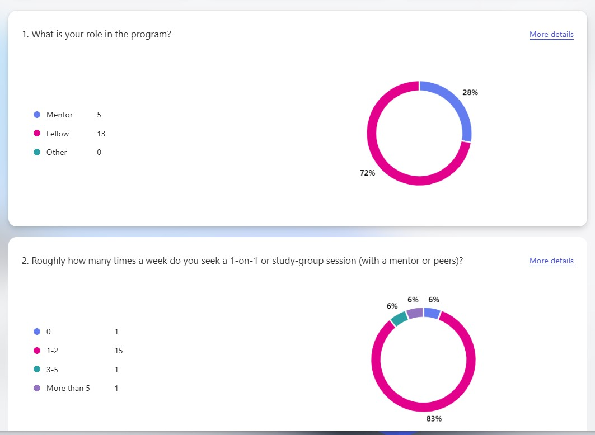
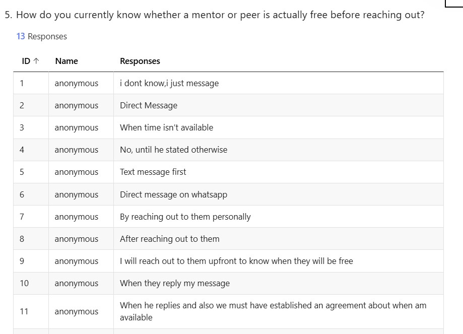
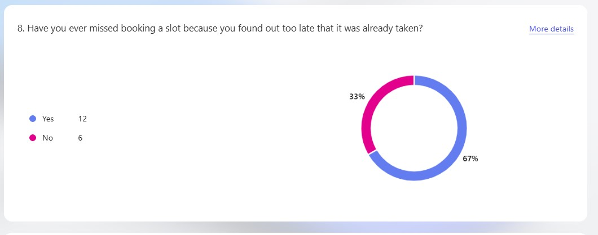
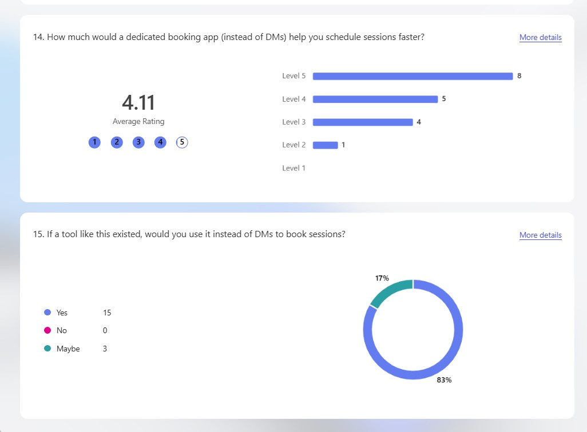

# BookIt
Mentor office hours and study-group pairing sessions are currently coordinated ad hoc. When fellow were asked how they know whether a mentor or study group partner is free, here are some responses we received:
- "I dont know,i just message"
- "When he replies and also we must have established an agreement about when am available"
- "I don’t"
- "	I will reach out to them upfront to know when they will be free"

Also they were some cases 71% occurrence where they found out the time they have chosen was already scheduled with another study group

BookIt aims to solve this blocker by showing real available slots to users and grant them the ability to book one without a single back-and-forth DM, and prevent any cases of double-booking.

## Questionnaire data

| Question category | Response Statistics |
| ---------- | ---------- |
| Role and frequncy of scheduled meeting |    |
|Availability of mentor or peer||
| Missed slots||
|People who would like a dedicated tool for booking||


# Getting started
Clone and start the repository locally by running
```

Set these values in `.env.local` from the team's shared Supabase project:

```env
NEXT_PUBLIC_SUPABASE_URL=...
NEXT_PUBLIC_SUPABASE_ANON_KEY=...
```

Do not commit `.env.local`.

## Database upgrade

For a fresh Supabase project, run `supabase/schema.sql` in the SQL editor.

If the existing team database already has the original `resources` and `bookings` tables, run:

`supabase/migrations/20260818_bookit_hardening.sql`

For a polished demo after at least one user has signed up, you can optionally run `supabase/seed.sql` to add the six reference-style resources and two future bookings.

The migration adds the resource UI fields (`type`, `skills`, `duration_minutes`, `status`), indexes, and a database exclusion constraint that rejects overlapping **confirmed** bookings for the same resource. The time range is half-open, so back-to-back sessions such as 10:00–11:00 and 11:00–12:00 remain valid.

## Google and GitHub OAuth

The login and signup screens use the same Supabase OAuth flow for both providers. The UI code is ready, but each provider must also be enabled in the shared Supabase project.

1. Enable **Google** and **GitHub** under Supabase Authentication providers and add each provider's client credentials.
2. In Supabase Auth URL configuration, add your local and deployed callback URLs to the redirect allow list, for example:
   - `http://localhost:3000/**` for local development
   - `https://<your-vercel-domain>/auth/callback` for the production app
3. Configure the provider application itself with the callback URL shown by Supabase for that provider.
4. Restart the local server after changing environment variables.

OAuth redirects back through `src/app/auth/callback/route.ts`, exchanges the PKCE auth code for a session, then sends the user to the requested protected route (dashboard by default).

## Quality checks

```bash
npm run lint
npm run typecheck
npm run build
```

Before demo day, test at minimum:


- Signup/login/logout and session persistence
- Google login/signup and GitHub login/signup
- Protected-route redirects
- Resource loading, error, empty, search and filter states
- Valid booking creation
- Exact duplicate and partial overlap rejection
- Back-to-back booking acceptance
- Cancellation and immediate query refresh
- Desktop and mobile layouts


BookIt is a full-stack learning-session booking platform for mentors and study groups.

It helps authenticated users discover learning resources, view real availability, book a specific time slot, manage upcoming and past sessions, and cancel future bookings without back-and-forth scheduling messages.

## Core Features

- Email/password authentication with Supabase
- Google and GitHub OAuth
- Protected authenticated routes
- Dashboard with booking statistics
- Mentor and study-group discovery
- Resource search and filtering
- Dynamic resource detail pages
- Multiple availability slots per resource
- Atomic slot-based booking
- Database-level overlap protection
- My Bookings with Upcoming and Past views
- Booking cancellation with future-slot release
- Responsive authenticated navigation

## Technology Stack

- Next.js 16 App Router
- React 19
- TypeScript
- Tailwind CSS
- Supabase Authentication
- Supabase PostgreSQL
- TanStack Query
- React Hook Form
- Zod
- Lucide React
- Git and GitHub

## Project Structure

```text
src/
  app/
  components/
  hooks/
  lib/
  providers/
  schemas/
  types/

supabase/
  schema.sql
  seed.sql
  migrations/